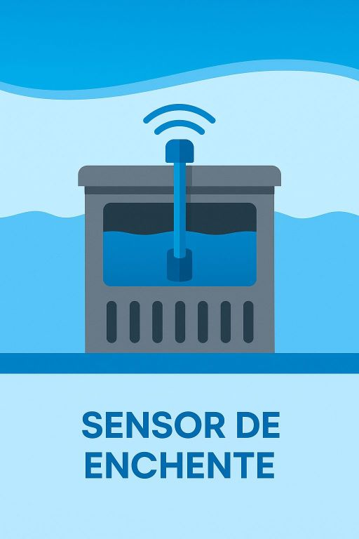

# 💧 Sistema de Monitoramento de Enchentes com ESP32

### Integrantes:
- **Kauã Rodrigues de Souza**  
- **Felipe Marceli**  
- **Gustavo Naoto**

---
### Links:

Youtube: https://youtu.be/_qfl7nQdot8
wokwi: https://wokwi.com/projects/432313695852112897
Github: https://github.com/kauarodrigues1/monitoramento_enchente_GS

## 📌 Descrição do Projeto

Este projeto tem como objetivo **prevenir enchentes** em áreas de risco por meio do monitoramento contínuo do nível da água. Utilizamos um **sensor ultrassônico de distância** conectado a um **ESP32**, que mede a altura da água em tempo real. Os dados são enviados para o **Orion Context Broker (FIWARE)** e visualizados em um **dashboard interativo** desenvolvido com **Dash e Plotly**.

Além disso, o sistema conta com:

- **LED vermelho**, que acende quando o nível da água está alto (indicando risco de enchente).
- **Buzzer**, que emite um som de alerta em situações críticas.

Essa solução pode ser aplicada em locais como:

- Bueiros e esgotos que frequentemente acumulam água da chuva.
- Canais de drenagem e rios.
- Áreas costeiras, para monitorar o nível do mar.

---

## ⚙️ Componentes Utilizados

- **ESP32** – Microcontrolador com Wi-Fi, responsável por ler os sensores e enviar os dados.
- **Sensor Ultrassônico (HC-SR04)** – Mede a distância entre o sensor e a superfície da água.
- **LED Vermelho** – Acende quando o nível da água atinge um limite crítico.
- **Buzzer** – Emite um alerta sonoro em situações de risco.
- **FIWARE Orion Context Broker** – Plataforma para gerenciamento e envio dos dados contextuais.
- **STH-Comet** – Serviço de histórico, que armazena os dados para visualização temporal.
- **Dashboard com Python (Dash + Plotly)** – Interface gráfica que exibe o nível da água em tempo real.

---

## 📊 Funcionamento do Sistema

1. O sensor ultrassônico mede a distância até a água.
2. Se a distância for menor que um limite seguro (indicando aumento do nível da água), o LED acende e o buzzer dispara.
3. Os dados são enviados via Orion Context Broker e armazenados pelo STH-Comet.
4. Um dashboard exibe os dados em tempo real com gráficos, indicando a média e o valor atual da distância medida.

---

## 📍 Aplicações Reais

- Prevenção de enchentes urbanas em bueiros e galerias pluviais.
- Monitoramento de rios e córregos em áreas residenciais.
- Observação do nível do mar em regiões costeiras.

